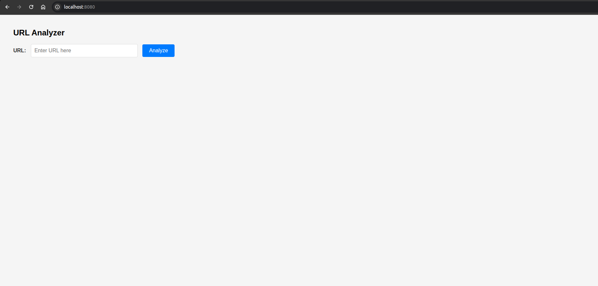
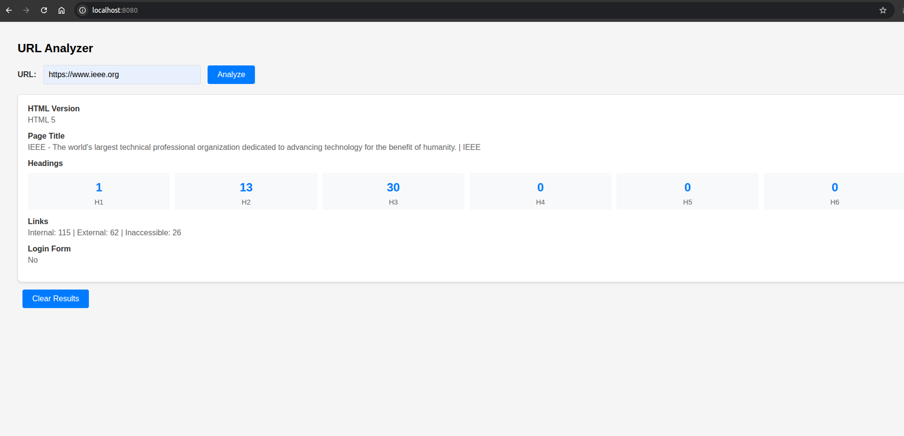
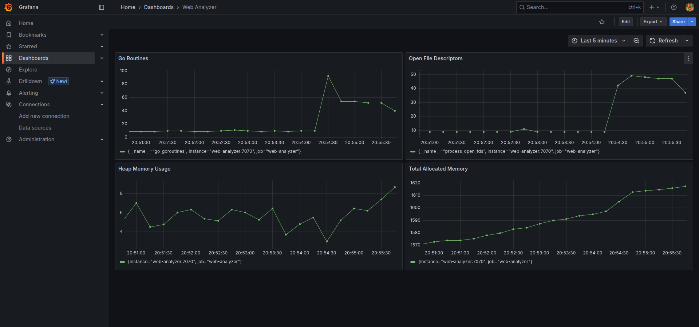
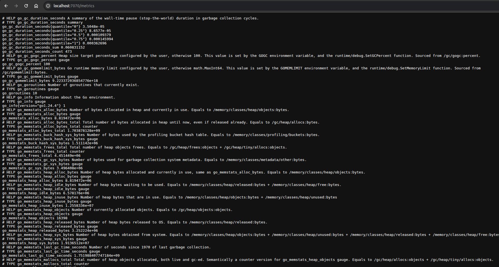

# Web Analyzer

## Project Overview

Web Analyzer is a web-based application designed to analyze and monitor web resources, providing insights and metrics for URLs. The project includes a backend service written in Go, configuration for logging and monitoring, and a dashboard for visualization.

---

## Prerequisites for building the project

for building the project locally - 

- **Go** (version 1.24.4 or higher) – [Install Go](https://golang.org/doc/install)
- **Make** (for running Makefile commands, optional)

for using docker environment for running the project -

- **Docker** (for containerization and running services) – [Install Docker](https://docs.docker.com/get-docker/)

both grafana and prometheus are configured using docker-compose so no need to install them locally

---

## Technologies Used

- **Backend:** Go (Golang) 
- **Frontend:** HTML and Javascript ([analyzer.html](./analyzer.html))
- **DevOps:**  
  - Docker ([Dockerfile](./Dockerfile), [docker-compose.yml](./docker-compose.yml))
  - Prometheus ([prometheus.yml](./prometheus.yml))
  - Grafana (Dashboard JSON in [dashboard/](./dashboard))

---

## External Dependencies

- Go modules are managed via `go.mod` and `go.sum`.
    - goquery v1.10.3 - Used for HTML parsing
    - pprof v1.5.3 - Enables performance profiling of Go applications
    - gin v1.10.1 - HTTP web framework
    - testify v1.10.0 - Provides assertion and mocking tools for unit testing
    - zap v1.27.0 - Logging library for Go
    - lumberjack.v2 v2.2.1 - Handles log file rotation and compression
    - prometheus/client_golang v1.22.0- Allows exposing Go application metrics for Prometheus monitoring
    - golang/mock v1.6.0 - Generating and using mock interfaces in tests
- To install Go dependencies:
  ```bash
  go mod download
  ```

---

## Setup Instructions

1. **Clone the repository:**
   ```bash
   git clone <your-repo-url>
   cd web-analyzer
   ```

2. **Install dependencies:**
   ```bash
   go mod download
   ```

3. **Build and run the application:**
   ```bash
   go build -o web-analyzer main.go
   ./web-analyzer
   ```

   Or use Docker:
   ```bash
   docker build -t web-analyzer .
   docker run -p 8080:8080 web-analyzer
   ```

4. **(Optional) Start with Docker Compose: (no building steps required)**
   ```bash
   docker-compose up
   ```

5. **Access the application: (After running the application)**
   - Open Web Interface: `http://localhost:8080/`
   - Backend API: 
   ```
   curl --location 'localhost:8080/api/v1/analyze' \
    --data '{
    "url": "https://example.com"
    }'
   ```
   - Prometheus: `http://localhost:9090/`
     - View prometheus metrics for the project: `http://localhost:7070/metrics`
   - Grafana: `http://localhost:3000/`
     - for visualizing grafana, login with credentials 
       - username - admin
       - password - admin
     - import dashboard by pasting the dashboard json
     

6. **Running unit tests and coverage reports**
    - Run unit tests

    ```bash
   make test
   ```
    - Run unit tests with coverage

    ```bash
   make coverage
   ```
    - Get code coverage report

    ```bash
   make coverage-html
   ```
---

## Usage & Main Functionalities

- **URL Analysis:** Submit URLs for analysis and receive metrics and reports.
- **Web Interface** Simple UI for submitting URLs for analysis and visualizing results
- **Logging:** All requests and errors are logged to `logs/web-analyzer.log` and log file rotation will occur automatically.
- **Monitoring:** Prometheus metrics are exposed for monitoring.
- **Dashboard:** Visualize metrics and analytics in Grafana.

---

## Challenges Faced & Solutions

- **Challenge:** Manually traversing HTML text for finding links and tags are faulty  
  **Solution:** Used goquery library for accurate HTML parsing

---

## Possible Improvements

- Add authentication and authorization for API endpoints (OAuth).
- Implement a richer frontend with a modern JS framework (React, Vue, etc.).
- Add automated tests and CI/CD pipeline.
- Provide a public API documentation (e.g., Swagger UI).
- Use rate limiters for managing high request traffic

---

## Demo

### Initial UI

### URL analysis results

### Grafana Dashboard

### Prometheus metrics for the project

